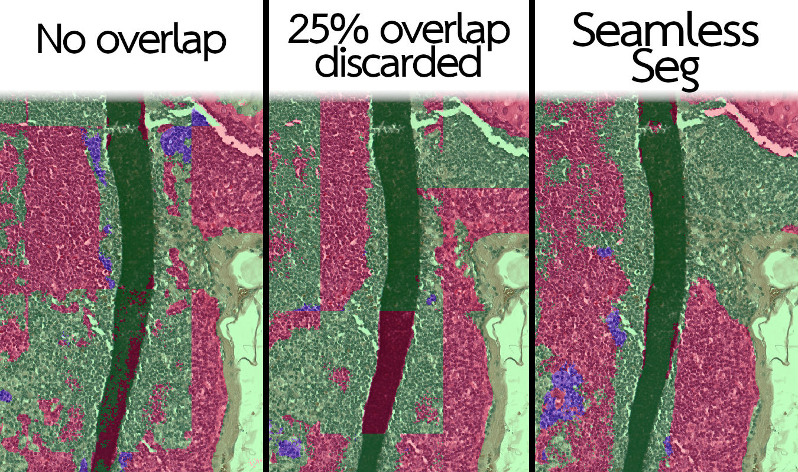
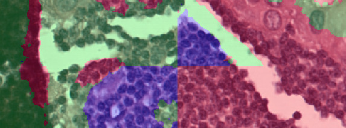
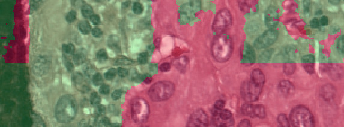
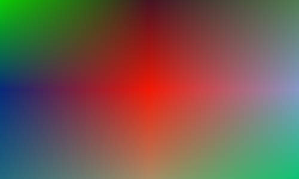

# `seamless_seg`: Seamless tiled segmentation postprocessing tools for large images

Typical strategies for segmenting large images involve tiling. Unfortunately this can cause visible, obviously incorrect seams between tiles. This repo provides postprocessing functions which gracefully remove *all* such tiling artifacts for any segmentation task.



* :white_check_mark: Optimal! No more tiling artifacts. Guaranteed seamless segmentation for any segmentation model.
* :floppy_disk: Efficient! Needs <1% of image in memory at once for large images (40000x40000 and above).
* :purple_circle: Decoupled! Minimal dependencies. Does not prescribe any IO libraries.
* :zap: Fast! Approx 0.25ms of overhead per tile.

## Installation

Copy `seamless_seg.py` into your project.

Dependencies: `shapely=2.0` and `scipy`.

<!-- TODO: pip? -->

## Getting started

If you have a very simple input-output pattern, you can use one of the convenience functions. This will automatically read/mix/write tiles with minimal memory overhead.

```python
import torch

import seamless_seg

model = # get pytorch model from somewhere
tile_size = # whatever size your model needs

# ###############################
# Example 1. A simple numpy array

import numpy as np

img = # a numpy image shaped [C, H, W]
out = seamless_seg.pytorch_numpy(model, img, tile_size)
# out is a argmax'd segmentation mask shaped [H, W]

# ##################################
# Example 2. Using rasterio and TIFs
import rasterio

in_fpath = # get geotiff image from somewhere
out_fpath = # where to save segmentation

with rasterio.open(in_fpath) as in_tif:
    seamless_seg.pytorch_rasterio(model, in_tif, out_fpath, tile_size)

```

If you need more control of input/output, you can use other `seamless_seg` functions. The general process is:

1. Define how to obtain logits and how to write after processing (e.g. disk IO functions).
2. Create a plan to break the image up into tiles.
3. Execute plan to read/mix/write those tiles.

Here's a minimum working example; it can be copy-paste'd and run as-is. In this case, the "reading" just generates a tile with a random colour for visualisation, and "writing" is all in-memory. In a real example, you would use the logits of a segmentation algorithm, and write each tile to disk as you reached it.

```python
import shapely
import numpy as np

import seamless_seg

image_size = (1024, 1024)
tile_size = (224, 224)
overlap = (64, 64)

# 1. Define how to obtain logits and how to write after processing
def random_logits(geom: shapely.Geometry):
    # Creating fake data; in real use cases, should yield model logits
    # obtained by running your model on image data within geom
    tile = np.ones((*tile_size, 3), dtype=np.uint8)
    tile *= np.random.randint(20, 255, (3,), dtype=np.uint8)
    return tile

out_img = np.zeros((*image_size, 3))
def write_to_numpy_array(geom, tile):
    # Writing to the in-memory numpy array above;
    # when evaluating on large files, this should write to disk instead
    y_slc, x_slc = seamless_seg.shape_to_slices(geom)
    out_img[y_slc, x_slc] = tile

# 2. Create a plan to break the image up into tiles.
def tile_generator(plan, get_logits):
    # Important: use seamless_seg.get_plan_logit_geoms to yield the correct order of tiles
    for index, geom in seamless_seg.get_plan_logit_geoms(plan):
        yield get_logits(geom)

plan, grid = seamless_seg.plan_regular_grid(image_size, tile_size, overlap)
in_tiles = tile_generator(plan, random_logits)

# 3. Execute plan to read/mix/write those tiles.
for index, out_geom, out_tile in seamless_seg.run_plan(plan, in_tiles):
    # Thanks to generators, this doesn't have to hold all tiles in memory at once
    write_to_numpy_array(out_geom, out_tile)
```

In a real example, the `in_tiles` from above should be a generator of logits. For convenience, `seamless_seg` provides a function to obtain logits from a simple pytorch model.

```python
plan = # Assume we have a plan already
model = # Assume we have a model from somewhere else
read_tile = # Callable that takes a geometry and return a numpy array of input data
# e.g. if you have an in_tif
def read_tile(shp):
    return in_tif.read(window=shape_to_slices(shp))

in_tiles = seamless_seg.pytorch_outputs_generator(plan, model, read_tile)
```

In the above examples, `seamless_seg` was responsible for creating the tile geometries, and used these to create the `plan`. You can bring your own input geometries.

```python
import seamless_seg

# grid must be a np.array shaped [H, W] where each element is a shapely.Geometry
# You can use seamless_seg functions to create this:
# You can create a perfectly regular grid
grid = seamless_seg.regular_grid(image_size, tile_size, overlap)
# or, you can try to coerce a flat list of geometries into a grid shape
grid = seamless_seg.coerce_to_grid(flat_list_of_geometries)
# or,
grid = # whatever you like

# Regardless, the planning will minimise the memory footprint
plan = seamless_seg.plan_from_grid(grid)
```

At the lowest level, if you just want to blend together tiles that you've loaded yourself, you can use:

```python
import seamless_seg

central_geom = # a shapely.Geometry
central_tile = # a np.ndarray
nearby_geoms = # list of shapely.Geometry
nearby_tiles = # list of np.ndarrays

weights = seamless_seg.overlap_weights(central_geom, nearby_geoms)
_, out_tile = seamless_seg.apply_weights(central_tile, nearby_tiles, weights)
```

## Optimisation

There are many optional parameters for each function. Most of these are optimisation parameters to run faster or with less RAM.

These are the most likely use cases, and how to do them:
* Run only on a small patch of a large image.
  * Pass `area=<shapely.Geometry>` where available.
* Extreme RAM requirements:
  * Pass `max_tiles=<int>` and `disk_cache_dir=<Path>` where available.
* Batching, running models in a separate thread:
  * Pytorch segmentation model: Pass `batch_size>1` to either `seamless_seg.pytorch_outputs_generator` or `seamless_seg.pytorch_rasterio`.
  * Custom segmentation: Use `seamless_seg.batched_tile_get` and `seamless_seg.threaded_batched_tile_get`.

## Explanation - Fixing tiling artifacts

### Where do tiling artifacts come from?

Tiling artifacts are a result of hard boundaries between adajcent tiles. The most naive approach is to select tiles with no overlap, and just let the model predict whatever it wills. At the boundary of those tiles, models will often make significantly different predictions. This results in sharp lines in your output segmentation.



This is not a model failure per se. The problem is just that the model is using a different context for pixels on one side of a boundary to the other side of that boundary. If it were given a full context around each object, it may still segment it correctly.

### Overlapping tiles

Typical solutions to this will always somehow use overlapping tiles. A slightly less naive approach commonly taken is to overlap tiles, and only keep a smaller window of the outputs. That solution *reduces* tiling artifacts, but does not remove them entirely. So long as there are hard boundaries between the tiles, tiling artifacts will appear.

<!-- TODO: Diagram explaining output crop margin. -->



In the extreme case, we could evaluate a tile centered on every single pixel independently and only trust that central pixel. But this involves lots of redundant calculation. We need a better solution.

### Trusting model outputs

Pixels at the edge of each tile have a truncated context because of their position within the tile. This lack of context degrades model performance at the edges of each tile.

<!-- TODO: Diagram showing truncated context -->

In some sense, this means that we should inherently trust the pixels at the edges less than those at the centre. So, we define a map of trustworthiness of each pixel. This is simply a measure of the distance of that pixel to the centre of the tile.

<!-- TODO: image of circle of trust -->

We can use the trust values to determine how much we should use from each overlapping tile. This gives us a distinct weighted sum at each pixel. Using a weighted sum based on distance produces a smooth transition across tiles. Pixels at the centre of an output tile come entirely from the model output for that tile, and pixels halfway between two tiles come 50% from each, etc.

<!-- TODO: diagram showing spatial relationship between these tiles. -->




These weights can be obtained by calling `seamless_seg.overlap_weights`, but you probably don't want to do that. It is recommended to use `seamless_seg.plan_regular_grid` instead.

## Tiling plan - optimising read/writes

Utilising the overlap weights described in the previous section is not inherently linked to using a regular grid of overlapping tiles, but usually that's what we want. To make the typical use case easier, `seamless_seg` includes `seamless_seg.plan_regular_grid` to create a tiling plan in the shape of a grid.


All you need to do is provide an image size, tile size and overlap amount (in pixels). The plan is created entirely within geometric pixel space. That is, the plan is made before any real data is read from disk. This allows you to inspect the plan and optimise reading from disk (e.g. batching, threaded/async).

Finally, `seamless_seg.run_plan` is provided to actually run the plan. To control memory usage, this can optionally be given a maximum number of tiles to keep in RAM at once.

### Memory

Often large segmentation tasks have images that are too large to fit into RAM. So, the tiling plan includes explicit load/unload instructions. Following this plan ensures that tiles are never requested more than once **and** that the minimum number of tiles are kept in memory. For some perspective, given a (40000, 40000) image with a tile size of (256, 256) and an overlap of (64, 64), there will be at most 1.0% of the image held in memory at once.

If even this is too large, you can use the `max_tiles` and `disk_cache_dir` arguments to hold as few tiles in memory as you need. Tiles beyond this limit will be cached to disk.
